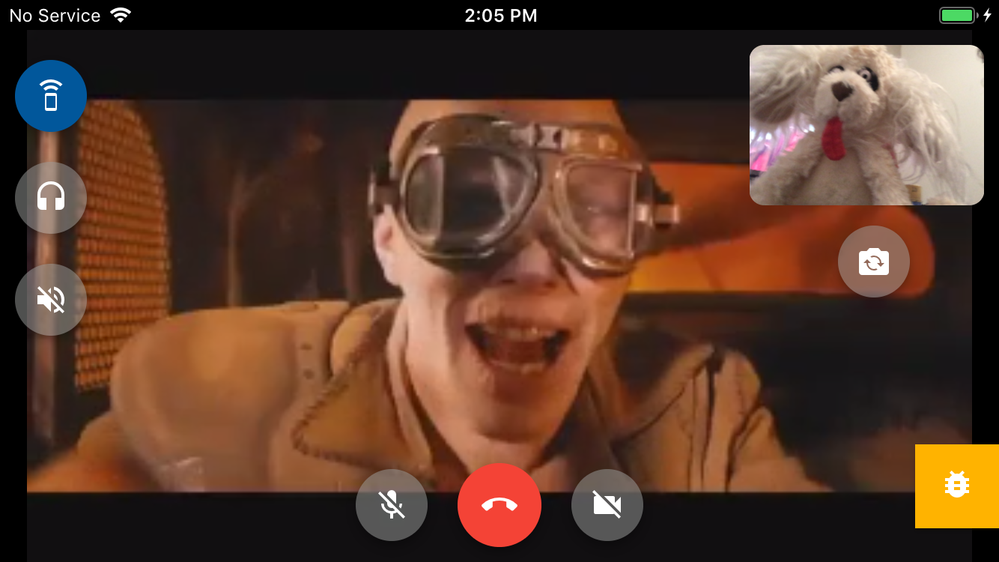

# cordova-plugin-iosrtc-sample

Basic sample application using cordova-plugin-iosrtc.

## Requirements

In order to make this Cordova plugin run into a iOS application some requirements must be satisfied in both development computer and target devices:

* Xcode >= 11.1 (11A1027)
* iOS >= 10.2 (run on lower versions at your own risk, don't report issues)
* `swift-version` => 4.2
* `cordova` >= 7.1.0
* `cordova-ios` >= 4.5.1

### Third-Party Library Examples

* WebRTC W3C v1.0.0
* WebRTC.framework => M69
* Janus => 0.7.4
* JSSip => 3.1.2
* Sip.js => 0.15.6
* Twilio => 2.0.0
* Open-Easyrtc => 2.0.5

## Author

[Harold Thetiot](https://sylaps.com)

### Maintainers

* [Harold Thetiot](https://sylaps.com)

## License

[MIT](./LICENSE) :)
